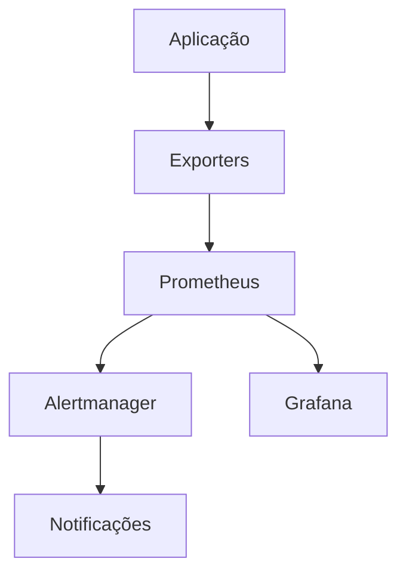

# Manual de Operação do Monitoramento

Este documento fornece instruções detalhadas para operar e manter o sistema de monitoramento.

## 1. Visão Geral do Sistema

### Componentes
- Prometheus: Coleta e armazenamento de métricas
- Alertmanager: Gerenciamento e roteamento de alertas
- Grafana: Visualização de dados e dashboards
- Exporters: Coletores de métricas específicos

### Arquitetura


## 2. Prometheus

### Acesso
- URL: http://localhost:9090
- Credenciais: Definidas em `prometheus.yml`
- Portas: 9090 (web), 9091 (push gateway)

### Configuração
```yaml
# prometheus.yml
global:
  scrape_interval: 15s
  evaluation_interval: 15s

scrape_configs:
  - job_name: 'app'
    static_configs:
      - targets: ['localhost:8000']
```

### Operações Comuns
1. Verificar status dos targets
2. Consultar métricas
3. Validar regras de alerta
4. Gerenciar storage

### Troubleshooting
1. Verificar logs: `journalctl -u prometheus`
2. Validar configuração: `promtool check config`
3. Testar conectividade: `curl localhost:9090/-/healthy`
4. Monitorar recursos: `top`, `df -h`

## 3. Alertmanager

### Acesso
- URL: http://localhost:9093
- Credenciais: Definidas em `alertmanager.yml`
- Portas: 9093 (web), 9094 (cluster)

### Configuração
```yaml
# alertmanager.yml
global:
  resolve_timeout: 5m

route:
  group_by: ['alertname']
  group_wait: 30s
  group_interval: 5m
  repeat_interval: 4h
  receiver: 'team-email'

receivers:
- name: 'team-email'
  email_configs:
  - to: 'team@example.com'
```

### Operações Comuns
1. Verificar alertas ativos
2. Silenciar alertas
3. Gerenciar receivers
4. Validar entrega

### Troubleshooting
1. Verificar logs: `journalctl -u alertmanager`
2. Testar configuração: `amtool check-config`
3. Verificar status: `curl localhost:9093/-/healthy`
4. Testar notificações: `amtool alert add`

## 4. Grafana

### Acesso
- URL: http://localhost:3000
- Credenciais: admin/admin (alterar no primeiro acesso)
- Portas: 3000 (web)

### Configuração
```ini
# grafana.ini
[server]
http_port = 3000

[security]
admin_user = admin
admin_password = admin

[auth.anonymous]
enabled = false
```

### Operações Comuns
1. Gerenciar dashboards
2. Configurar datasources
3. Gerenciar usuários
4. Backup de configurações

### Troubleshooting
1. Verificar logs: `journalctl -u grafana-server`
2. Validar permissões: `ls -l /var/lib/grafana`
3. Testar banco: `grafana-cli db status`
4. Verificar plugins: `grafana-cli plugins ls`

## 5. Métricas

### Métricas de Sistema
```promql
# CPU Usage
rate(process_cpu_seconds_total[5m])

# Memory Usage
process_resident_memory_bytes

# Disk IO
rate(node_disk_io_time_seconds_total[5m])
```

### Métricas de Aplicação
```promql
# Request Rate
rate(http_requests_total[5m])

# Error Rate
rate(http_requests_total{status=~"5.."}[5m])

# Latency
histogram_quantile(0.95, rate(http_request_duration_seconds_bucket[5m]))
```

### Métricas de Segurança
```promql
# Rate Limit Violations
rate(rate_limit_violations_total[5m])

# Security Events
rate(security_events_total[5m])

# Authentication Failures
rate(auth_failures_total[5m])
```

## 6. Alertas

### Configuração de Alertas
```yaml
# alerts.yml
groups:
- name: app
  rules:
  - alert: HighErrorRate
    expr: rate(http_requests_total{status=~"5.."}[5m]) > 0.1
    for: 5m
    labels:
      severity: critical
    annotations:
      summary: High error rate detected
```

### Níveis de Severidade
1. Critical: Requer ação imediata
2. Warning: Requer atenção
3. Info: Informativo apenas

### Roteamento de Alertas
```yaml
# routing.yml
routes:
- match:
    severity: critical
  receiver: pager-duty
- match:
    severity: warning
  receiver: slack
```

## 7. Dashboards

### Dashboard Principal
- Overview do sistema
- Métricas críticas
- Status dos serviços
- Alertas ativos

### Security Dashboard
- Rate limit violations
- Security events
- Authentication status
- Suspicious activities

### Performance Dashboard
- Latency metrics
- Error rates
- Resource usage
- Throughput

## 8. Backup e Recuperação

### Backup
```bash
# Prometheus
promtool tsdb snapshot /data/prometheus backup/

# Grafana
grafana-cli admin data-migration backup

# Alertmanager
cp -r /etc/alertmanager/data backup/
```

### Recuperação
```bash
# Prometheus
promtool tsdb snapshot restore backup/

# Grafana
grafana-cli admin data-migration restore

# Alertmanager
systemctl stop alertmanager
cp -r backup/* /etc/alertmanager/data/
systemctl start alertmanager
```

## 9. Manutenção

### Diária
1. Verificar alertas ativos
2. Monitorar uso de recursos
3. Validar backups
4. Revisar logs

### Semanal
1. Análise de tendências
2. Ajuste de thresholds
3. Limpeza de dados antigos
4. Verificação de integridade

### Mensal
1. Revisão de políticas
2. Atualização de documentação
3. Teste de recuperação
4. Otimização de queries

## 10. Checklist Operacional

### Início do Turno
- [ ] Verificar status dos serviços
- [ ] Revisar alertas pendentes
- [ ] Validar métricas críticas
- [ ] Checar espaço em disco

### Fim do Turno
- [ ] Documentar incidentes
- [ ] Verificar backups
- [ ] Atualizar documentação
- [ ] Passar pendências

### Emergências
- [ ] Identificar causa raiz
- [ ] Isolar problema
- [ ] Comunicar stakeholders
- [ ] Implementar correção
- [ ] Documentar lições aprendidas 