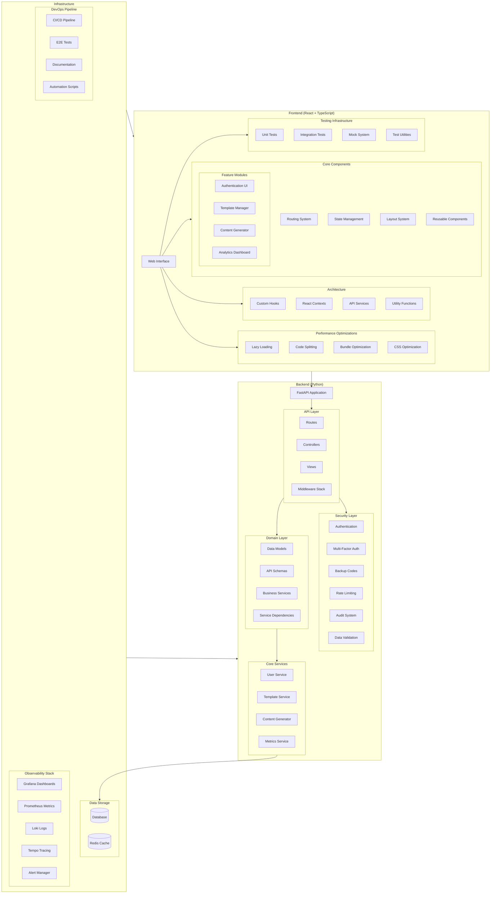

# Arquitetura Atual do Projeto - Marketing Automation Agency

## Visão Geral da Arquitetura

## Componentes Principais

### Frontend (React + TypeScript)

1. **Core Components**
   - Sistema de rotas com React Router
   - Gerenciamento de estado centralizado
   - Layouts responsivos reutilizáveis
   - Biblioteca de componentes compartilhados

2. **Arquitetura Cliente**
   - Hooks customizados para lógica reutilizável
   - Contexts para estado global
   - Serviços de API isolados
   - Funções utilitárias compartilhadas

3. **Performance**
   - Lazy loading de componentes
   - Code splitting por rota
   - Otimização de bundle size
   - Otimização de CSS e assets

4. **Infraestrutura de Testes**
   - Testes unitários com Jest
   - Testes de integração
   - Sistema de mocks
   - Utilitários de teste compartilhados

### Backend (Python)

1. **Camada API**
   - Rotas FastAPI
   - Controllers para lógica de apresentação
   - Views para formatação de resposta
   - Middleware para processamento de requisições

2. **Segurança**
   - Autenticação JWT
   - Sistema MFA completo com backup codes
   - Rate limiting por endpoint
   - Sistema de auditoria
   - Validação de dados em múltiplas camadas

3. **Camada de Domínio**
   - Modelos de dados SQLAlchemy
   - Schemas Pydantic
   - Serviços de negócio
   - Injeção de dependências

4. **Serviços Core**
   - Gerenciamento de usuários
   - Sistema de templates
   - Gerador de conteúdo
   - Coleta e análise de métricas

### Infraestrutura

1. **Armazenamento de Dados**
   - Banco de dados principal
   - Cache Redis para performance

2. **Stack de Observabilidade**
   - Dashboards Grafana
   - Métricas Prometheus
   - Logs centralizados com Loki
   - Distributed tracing com Tempo
   - Sistema de alertas

3. **Pipeline DevOps**
   - CI/CD automatizado
   - Testes E2E
   - Documentação técnica
   - Scripts de automação

## Fluxos Principais

1. **Autenticação**
   - Login com JWT
   - Verificação MFA
   - Geração/validação de backup codes
   - Auditoria de acessos

2. **Geração de Conteúdo**
   - Seleção de template
   - Customização de parâmetros
   - Geração e preview
   - Exportação

3. **Monitoramento**
   - Coleta de métricas em tempo real
   - Agregação de logs
   - Tracing de requisições
   - Alertas automáticos

## Considerações de Segurança

1. **Autenticação e Autorização**
   - JWT com rotação de tokens
   - MFA obrigatório para ações sensíveis
   - Backup codes para recuperação
   - Auditoria completa de ações

2. **Proteção de Dados**
   - Validação em múltiplas camadas
   - Rate limiting adaptativo
   - Sanitização de inputs
   - Encryption em trânsito e em repouso

3. **Monitoramento de Segurança**
   - Detecção de anomalias
   - Alertas de segurança
   - Logs de auditoria
   - Métricas de segurança

## Observabilidade

1. **Métricas**
   - Performance de API
   - Uso de recursos
   - Métricas de negócio
   - Indicadores de segurança

2. **Logging**
   - Logs estruturados
   - Agregação centralizada
   - Retenção configurável
   - Análise em tempo real

3. **Tracing**
   - Rastreamento de requisições
   - Análise de performance
   - Debugging distribuído
   - Correlação de eventos

## Estrutura do Projeto

.
├── 19:07:53.log
├── 19:09:44.log
├── CRONOGRAMA.md
├── LICENSE
├── README.md
├── app
│   └── core
│       └── audit.py
├── assistant_snippet_A03l+ZRD61.txt
├── assistant_snippet_Hs2Wd4Aqxm.txt
├── assistant_snippet_Ik7t9FyXkK.txt
├── assistant_snippet_Js9I7l6+HT.txt
├── assistant_snippet_KifAQa
│   └── QPu.txt
├── assistant_snippet_ky4hvYSrqP.txt
├── assistant_snippet_txjYhJf+AU.txt
├── backend
│   ├── Dockerfile
│   ├── __init__.py
│   ├── alembic
│   │   ├── env.py
│   │   ├── script.py.mako
│   │   └── versions
│   │       ├── 33081345cae1_create_initial_tables.py
│   │       ├── b319fac4b57b_create_users_table.py
│   │       └── create_content_tables.py
│   ├── alembic.ini
│   ├── alertmanager
│   │   ├── config.yml
│   │   └── templates
│   │       ├── email.tmpl
│   │       └── slack.tmpl
│   ├── app
│   │   ├── __init__.py
│   │   ├── api
│   │   │   ├── __init__.py
│   │   │   ├── routes
│   │   │   │   ├── __init__.py
│   │   │   │   └── metrics.py
│   │   │   └── v1
│   │   │       ├── __init__.py
│   │   │       ├── api.py
│   │   │       └── endpoints
│   │   │           ├── __init__.py
│   │   │           └── health.py
│   │   ├── auth
│   │   │   └── dependencies.py
│   │   ├── controllers
│   │   │   ├── __init__.py
│   │   │   └── user_controller.py
│   │   ├── core
│   │   │   ├── __init__.py
│   │   │   ├── alerts.py
│   │   │   ├── audit.py
│   │   │   ├── audit_example.py
│   │   │   ├── audit_export.py
│   │   │   ├── audit_middleware.py
│   │   │   ├── auth.py
│   │   │   ├── circuit_breaker.py
│   │   │   ├── clickhouse.py
│   │   │   ├── config.py
│   │   │   ├── events.py
│   │   │   ├── exceptions.py
│   │   │   ├── mfa.py
│   │   │   ├── middleware.py
│   │   │   ├── monitoring.py
│   │   │   ├── notifications.py
│   │   │   ├── optimizations.py
│   │   │   ├── redis.py
│   │   │   ├── redis_config.py
│   │   │   ├── security.py
│   │   │   ├── security_middleware.py
│   │   │   └── validation.py
│   │   ├── database
│   │   │   ├── __init__.py
│   │   │   ├── connection.py
│   │   │   └── session.py
│   │   ├── db
│   │   │   ├── __init__.py
│   │   │   ├── base.py
│   │   │   ├── base_all.py
│   │   │   ├── base_class.py
│   │   │   ├── deps.py
│   │   │   └── session.py
│   │   ├── dependencies.py
│   │   ├── main.py
│   │   ├── middleware
│   │   │   ├── __init__.py
│   │   │   ├── auth.py
│   │   │   ├── circuit_breaker.py
│   │   │   ├── cors.py
│   │   │   ├── error_handler.py
│   │   │   ├── input_validation.py
│   │   │   ├── metrics.py
│   │   │   ├── optimization.py
│   │   │   ├── rate_limit.py
│   │   │   └── security.py
│   │   ├── models
│   │   │   ├── __init__.py
│   │   │   ├── audit.py
│   │   │   ├── audit_log.py
│   │   │   ├── content.py
│   │   │   ├── generation.py
│   │   │   ├── template.py
│   │   │   └── user.py
│   │   ├── monitoring
│   │   │   ├── metrics.py
│   │   │   ├── metrics_exporter.py
│   │   │   └── security_metrics.py
│   │   ├── routers
│   │   │   ├── __init__.py
│   │   │   ├── analytics.py
│   │   │   ├── audit.py
│   │   │   ├── auth.py
│   │   │   ├── content.py
│   │   │   ├── generations.py
│   │   │   ├── monitoring.py
│   │   │   ├── templates.py
│   │   │   ├── test_endpoints.py
│   │   │   └── users.py
│   │   ├── schemas
│   │   │   ├── __init__.py
│   │   │   ├── audit.py
│   │   │   ├── auth.py
│   │   │   ├── content.py
│   │   │   ├── generation.py
│   │   │   ├── template.py
│   │   │   └── user.py
│   │   ├── scripts
│   │   │   └── create_test_user.py
│   │   ├── services
│   │   │   ├── __init__.py
│   │   │   ├── ai_config_service.py
│   │   │   ├── ai_service.py
│   │   │   ├── cache_service.py
│   │   │   ├── content_service.py
│   │   │   ├── monitoring_service.py
│   │   │   ├── providers
│   │   │   │   ├── __init__.py
│   │   │   │   ├── anthropic_provider.py
│   │   │   │   ├── base_provider.py
│   │   │   │   ├── cohere_provider.py
│   │   │   │   └── openai_provider.py
│   │   │   ├── queue_service.py
│   │   │   ├── rate_limiter.py
│   │   │   └── user_service.py
│   │   └── views
│   │       └── __init__.py
│   ├── app.log
│   ├── backend.egg-info
│   │   ├── PKG-INFO
│   │   ├── SOURCES.txt
│   │   ├── dependency_links.txt
│   │   ├── requires.txt
│   │   └── top_level.txt
│   ├── backup
│   ├── conftest.py
│   ├── create_tables.py
│   ├── docs
│   │   ├── README.md
│   │   ├── alerts.md
│   │   ├── metrics.md
│   │   ├── monitoring_operations.md
│   │   ├── openapi.yaml
│   │   ├── performance_optimizations.md
│   │   ├── postman
│   │   │   └── ai_agency.json
│   │   ├── security_best_practices.md
│   │   ├── static
│   │   │   ├── redoc.standalone.js
│   │   │   ├── swagger-ui-bundle.js
│   │   │   └── swagger-ui.css
│   │   └── troubleshooting.md
│   ├── grafana
│   │   └── dashboards
│   │       └── security.json
│   ├── init_test_db.py
│   ├── logs
│   │   ├── ai_platform.log
│   │   ├── security
│   │   └── security_audit.log
│   ├── prometheus
│   │   └── rules
│   │       └── security_alerts.yml
│   ├── prometheus.yml
│   ├── pyproject.toml
│   ├── requirements-test.txt
│   ├── requirements.txt
│   ├── run.py
│   ├── scripts
│   │   ├── check_redis.py
│   │   ├── create_test_user.py
│   │   ├── init_db.py
│   │   ├── reset_password.py
│   │   ├── run_tests.sh
│   │   ├── setup_db.sh
│   │   ├── start_server.sh
│   │   └── wait-for-it.sh
│   ├── setup.py
│   ├── start.sh
│   ├── static
│   │   ├── redoc.standalone.js
│   │   ├── swagger-ui-bundle.js
│   │   └── swagger-ui.css
│   ├── test.db
│   └── tests
│       ├── __init__.py
│       ├── conftest.py
│       ├── create_tables.py
│       ├── init_test_db.py
│       ├── integration
│       │   ├── __init__.py
│       │   ├── conftest.py
│       │   ├── test_auth.py
│       │   ├── test_metrics_integration.py
│       │   ├── test_mfa_rate_limit.py
│       │   ├── test_redis_rate_limit.py
│       │   ├── test_root.py
│       │   └── test_system_resilience.py
│       ├── load
│       │   └── results
│       │       ├── 20241228_212750_constant_load.json
│       │       └── 20241228_212750_ramp_up.json
│       ├── middleware
│       │   ├── __init__.py
│       │   ├── test_rate_limit.py
│       │   └── test_security_middleware.py
│       ├── monitoring
│       │   ├── __init__.py
│       │   ├── test_metrics_exporter.py
│       │   ├── test_monitoring_config.py
│       │   └── test_security_metrics.py
│       ├── security
│       │   ├── __init__.py
│       │   ├── test_audit.py
│       │   ├── test_authentication.py
│       │   ├── test_endpoints.py
│       │   ├── test_input_validation.py
│       │   ├── test_mfa.py
│       │   ├── test_mfa_load.py
│       │   ├── test_middleware.py
│       │   ├── test_monitoring.py
│       │   ├── test_notifications.py
│       │   ├── test_rate_limit.py
│       │   ├── test_rate_limit_isolated.py
│       │   ├── test_security.py
│       │   ├── test_security_endpoints.py
│       │   ├── test_security_headers.py
│       │   ├── test_security_middleware.py
│       │   ├── test_security_scan.py
│       │   └── test_validation.py
│       ├── test_api_rate_limit.py
│       ├── test_audit.py
│       ├── test_settings.py
│       └── utils
│           ├── __init__.py
│           ├── create_tables.py
│           └── init_test_db.py
├── content.py
├── core
│   ├── README.md
│   ├── __init__.py
│   ├── ai
│   │   ├── README.md
│   │   ├── __init__.py
│   │   ├── base.py
│   │   ├── orchestrator.py
│   │   └── providers
│   │       ├── __init__.py
│   │       ├── anthropic.py
│   │       ├── cohere.py
│   │       └── openai.py
│   ├── monitoring
│   │   ├── README.md
│   │   ├── __init__.py
│   │   └── metrics.py
│   └── security
│       ├── README.md
│       ├── __init__.py
│       └── auth.py
├── docker-compose.monitoring.yml
├── docker-compose.test.yml
├── docker-compose.yml
├── docs
│   ├── ARCHITECTURE.md
│   ├── CONTRIBUTING.md
│   ├── CURRENT_ARCHITECTURE.md
│   ├── INTEGRATION_FLOW.md
│   ├── PLANO_CONTINGENCIA.md
│   ├── api
│   │   └── README.md
│   ├── architecture
│   │   ├── README.md
│   │   └── system_architecture.md
│   ├── deployment
│   │   └── README.md
│   ├── deployment-plan.md
│   ├── frontend
│   │   ├── EXAMPLES.md
│   │   ├── README.md
│   │   ├── STYLES.md
│   │   └── TESTING.md
│   ├── test-plan.md
│   ├── user-guide.md
│   └── user_guides
│       ├── README.md
│       ├── ai_providers.md
│       ├── content_generation.md
│       ├── dev_environment.md
│       ├── security_monitoring.md
│       ├── template_management.md
│       └── templates.md
├── frontend
│   ├── Dockerfile
│   ├── README.md
│   ├── babel.config.js
│   ├── eslint.config.js
│   ├── index.html
│   ├── jest.config.ts
│   ├── package-lock.json
│   ├── package.json
│   ├── postcss.config.cjs
│   ├── public
│   │   └── vite.svg
│   ├── services
│   │   └── analytics
│   │       └── shared
│   ├── src
│   │   ├── App.css
│   │   ├── App.tsx
│   │   ├── __mocks__
│   │   │   ├── fileMock.js
│   │   │   └── useTemplate.ts
│   │   ├── __tests__
│   │   │   ├── components
│   │   │   │   ├── AdvancedMetrics.test.tsx
│   │   │   │   ├── AnalyticsPanel.test.tsx
│   │   │   │   ├── ContentGenerator.test.tsx
│   │   │   │   ├── Dashboard.test.tsx
│   │   │   │   ├── GenerationHistory.test.tsx
│   │   │   │   ├── GenerationPreview.test.tsx
│   │   │   │   ├── Header.test.tsx
│   │   │   │   ├── Layout.test.tsx
│   │   │   │   ├── MetricCard.test.tsx
│   │   │   │   ├── PromptConfig.test.tsx
│   │   │   │   ├── Sidebar.test.tsx
│   │   │   │   ├── TemplateEditor.test.tsx
│   │   │   │   ├── TemplateEditorModal.test.tsx
│   │   │   │   ├── TemplateForm.test.tsx
│   │   │   │   ├── TemplateManager.test.tsx
│   │   │   │   └── common
│   │   │   │       ├── ConfirmationModal.test.tsx
│   │   │   │       └── Notifications.test.tsx
│   │   │   ├── hooks
│   │   │   │   └── useAI.test.ts
│   │   │   └── pages
│   │   │       ├── AnalyticsPage.test.tsx
│   │   │       └── PromptConfigPage.test.tsx
│   │   ├── assets
│   │   │   └── react.svg
│   │   ├── components
│   │   │   ├── AdvancedMetrics.tsx
│   │   │   ├── AnalyticsPanel.tsx
│   │   │   ├── ContentGenerator.tsx
│   │   │   ├── Dashboard.tsx
│   │   │   ├── GenerationHistory.tsx
│   │   │   ├── GenerationPreview.tsx
│   │   │   ├── Header.tsx
│   │   │   ├── Layout.tsx
│   │   │   ├── MetricCard.tsx
│   │   │   ├── Navigation.tsx
│   │   │   ├── PrivateRoute.tsx
│   │   │   ├── PromptConfig.tsx
│   │   │   ├── Sidebar.tsx
│   │   │   ├── SimpleTemplateEditor.tsx
│   │   │   ├── TemplateEditor.css
│   │   │   ├── TemplateEditor.test.tsx
│   │   │   ├── TemplateEditor.tsx
│   │   │   ├── TemplateEditorModal.tsx
│   │   │   ├── TemplateForm.tsx
│   │   │   ├── TemplateManager.tsx
│   │   │   ├── __tests__
│   │   │   │   ├── Dashboard.test.tsx
│   │   │   │   ├── MetricCard.test.tsx
│   │   │   │   ├── TemplateManager.test.tsx
│   │   │   │   └── common
│   │   │   │       └── Notifications.test.tsx
│   │   │   ├── common
│   │   │   │   ├── ConfirmationModal.tsx
│   │   │   │   ├── Navigation.tsx
│   │   │   │   ├── Notifications.tsx
│   │   │   │   ├── RateLimitAlert.tsx
│   │   │   │   └── __tests__
│   │   │   │       ├── ErrorStates.test.tsx
│   │   │   │       ├── RateLimitAlert.test.tsx
│   │   │   │       └── ResponsiveTests.test.tsx
│   │   │   └── templates
│   │   │       ├── ValidationRules.tsx
│   │   │       ├── VariableEditor.tsx
│   │   │       └── VersionHistory.tsx
│   │   ├── contexts
│   │   │   ├── AuthContext.tsx
│   │   │   ├── NotificationContext.tsx
│   │   │   ├── auth.tsx
│   │   │   └── index.ts
│   │   ├── hooks
│   │   │   ├── __tests__
│   │   │   │   ├── useAnalytics.test.ts
│   │   │   │   ├── useAnalytics.test.tsx
│   │   │   │   ├── useNotification.test.ts
│   │   │   │   └── usePromptConfig.test.tsx
│   │   │   ├── upload
│   │   │   ├── useAI.ts
│   │   │   ├── useAnalytics.ts
│   │   │   ├── useAuth.ts
│   │   │   ├── useContentGeneration.ts
│   │   │   ├── useNotification.ts
│   │   │   ├── useNotifications.ts
│   │   │   ├── usePromptConfig.ts
│   │   │   ├── useRateLimit.ts
│   │   │   └── useTemplate.ts
│   │   ├── index.css
│   │   ├── index.tsx
│   │   ├── layouts
│   │   │   └── DefaultLayout.tsx
│   │   ├── main.tsx
│   │   ├── pages
│   │   │   ├── Analytics.tsx
│   │   │   ├── AnalyticsPage.tsx
│   │   │   ├── ContentGeneratorPage.tsx
│   │   │   ├── Dashboard.tsx
│   │   │   ├── GenerationDetails.tsx
│   │   │   ├── GenerationHistoryPage.tsx
│   │   │   ├── HomePage.tsx
│   │   │   ├── Login.tsx
│   │   │   ├── PromptConfigPage.tsx
│   │   │   ├── TemplateEditorPage.tsx
│   │   │   ├── TemplateListPage.tsx
│   │   │   ├── Templates.tsx
│   │   │   ├── generations
│   │   │   ├── settings
│   │   │   │   └── UserSettings.tsx
│   │   │   └── templates
│   │   ├── routes
│   │   │   ├── __tests__
│   │   │   │   └── Navigation.test.tsx
│   │   │   ├── auth
│   │   │   │   └── Login.tsx
│   │   │   ├── dashboard
│   │   │   │   └── Dashboard.tsx
│   │   │   └── index.tsx
│   │   ├── routes.tsx
│   │   ├── services
│   │   │   ├── __tests__
│   │   │   │   ├── analyticsService.test.ts
│   │   │   │   ├── api.test.ts
│   │   │   │   └── promptConfigService.test.ts
│   │   │   ├── analyticsService.ts
│   │   │   ├── api.ts
│   │   │   ├── contentService.ts
│   │   │   ├── generationService.ts
│   │   │   ├── mfaService.ts
│   │   │   ├── promptConfigService.ts
│   │   │   ├── reports
│   │   │   ├── templateService.ts
│   │   │   └── userService.ts
│   │   ├── setupTests.ts
│   │   ├── store
│   │   │   ├── hooks.ts
│   │   │   ├── index.ts
│   │   │   └── slices
│   │   │       └── notificationsSlice.ts
│   │   ├── styles
│   │   │   └── theme.ts
│   │   ├── theme.ts
│   │   ├── types
│   │   │   ├── Template.ts
│   │   │   ├── content.ts
│   │   │   └── index.ts
│   │   ├── utils
│   │   │   ├── classNames.ts
│   │   │   └── dateUtils.ts
│   │   └── vite-env.d.ts
│   ├── tailwind.config.js
│   ├── tsconfig.app.json
│   ├── tsconfig.json
│   ├── tsconfig.node.json
│   ├── tsconfig.test.json
│   ├── vite.config.ts
│   └── vitest.config.ts
├── grafana
│   ├── dashboards
│   │   ├── business.json
│   │   ├── logs.json
│   │   ├── overview.json
│   │   ├── performance.json
│   │   ├── security.json
│   │   └── security_audit.json
│   ├── docker-compose.prod.yml
│   └── provisioning
│       ├── alerting
│       │   └── alerts.yml
│       ├── dashboards
│       │   ├── ai_providers.json
│       │   ├── dashboard.yml
│       │   ├── dashboards.yml
│       │   ├── main_dashboard.json
│       │   ├── provider.yml
│       │   ├── security.yaml
│       │   ├── services.json
│       │   └── system.json
│       └── datasources
│           ├── datasource.yml
│           ├── loki.yml
│           ├── prometheus.yml
│           └── security.yaml
├── infrastructure
│   ├── kubernetes
│   │   └── deployment.yaml
│   └── terraform
├── install_dependencies.sh
├── load-test-summary.json
├── logs
│   └── ai_platform.log
├── loki
│   ├── data
│   │   ├── chunks
│   │   ├── index
│   │   └── wal
│   ├── docker-compose.prod.yml
│   ├── loki-config.yml
│   └── promtail-config.yml
├── monitoring
│   ├── logs
│   │   └── health-check.log
│   └── metrics-validation-2024-12-27
├── package-lock.json
├── package.json
├── prometheus
│   ├── alertmanager
│   │   ├── alertmanager.yml
│   │   └── templates
│   │       └── default.tmpl
│   ├── docker-compose.prod.yml
│   ├── prometheus.prod.yml
│   ├── prometheus.yml
│   ├── pushgateway
│   │   └── pushgateway.yml
│   └── rules
│       ├── alerts.yml
│       ├── continuous-monitoring.yml
│       ├── deploy-alerts.yml
│       └── recording.yml
├── prometheus.yml
├── pytest.ini
├── requirements.txt
├── scripts
│   ├── analyze_mfa_feedback.py
│   ├── backup.sh
│   ├── deploy-test.sh
│   ├── error-analysis.sh
│   ├── gradual-deploy.sh
│   ├── health-check.sh
│   ├── implement_mfa_improvements.py
│   ├── pre-deploy-check.sh
│   ├── resource-monitoring.sh
│   ├── restore.sh
│   ├── rollback.sh
│   ├── run-all-tests.sh
│   ├── run-load-tests.sh
│   ├── schedule-backups.sh
│   ├── setup-monitoring.sh
│   ├── setup-production.sh
│   └── validate-metrics.sh
├── services
│   ├── ai-orchestrator
│   │   ├── Dockerfile
│   │   ├── app
│   │   │   ├── api
│   │   │   │   └── routes
│   │   │   │       └── generate.py
│   │   │   ├── core
│   │   │   │   ├── config.py
│   │   │   │   ├── providers.py
│   │   │   │   └── rate_limiter.py
│   │   │   ├── main.py
│   │   │   └── services
│   │   │       └── orchestrator.py
│   │   └── requirements.txt
│   ├── analytics
│   │   ├── Dockerfile
│   │   ├── app
│   │   │   ├── api
│   │   │   │   ├── dependencies
│   │   │   │   │   └── auth.py
│   │   │   │   └── routes
│   │   │   │       └── metrics.py
│   │   │   ├── core
│   │   │   │   ├── clickhouse.py
│   │   │   │   └── config.py
│   │   │   ├── main.py
│   │   │   └── services
│   │   │       └── event_processor.py
│   │   ├── requirements.txt
│   │   └── shared
│   │       ├── __init__.py
│   │       └── cache.py
│   ├── auth
│   │   ├── Dockerfile
│   │   ├── alembic
│   │   │   ├── env.py
│   │   │   └── versions
│   │   │       ├── add_mfa_backup_fields.py
│   │   │       ├── add_mfa_fields.py
│   │   │       └── initial_migration.py
│   │   ├── alembic.ini
│   │   ├── app
│   │   │   ├── api
│   │   │   │   ├── dependencies
│   │   │   │   │   ├── auth.py
│   │   │   │   │   └── database.py
│   │   │   │   └── routes
│   │   │   │       ├── auth.py
│   │   │   │       ├── mfa.py
│   │   │   │       └── users.py
│   │   │   ├── core
│   │   │   │   ├── config.py
│   │   │   │   ├── mfa.py
│   │   │   │   ├── rbac.py
│   │   │   │   └── security.py
│   │   │   ├── db
│   │   │   │   ├── base.py
│   │   │   │   ├── base_class.py
│   │   │   │   └── session.py
│   │   │   ├── main.py
│   │   │   ├── models
│   │   │   │   └── user.py
│   │   │   ├── schemas
│   │   │   │   ├── token.py
│   │   │   │   └── user.py
│   │   │   ├── services
│   │   │   │   ├── email.py
│   │   │   │   └── user.py
│   │   │   └── templates
│   │   │       └── email
│   │   │           ├── mfa_backup_codes.html
│   │   │           ├── mfa_disabled_alert.html
│   │   │           └── mfa_recovery.html
│   │   ├── auth_service.egg-info
│   │   │   ├── PKG-INFO
│   │   │   ├── SOURCES.txt
│   │   │   ├── dependency_links.txt
│   │   │   ├── requires.txt
│   │   │   └── top_level.txt
│   │   ├── requirements.txt
│   │   └── setup.py
│   └── content
│       ├── Dockerfile
│       ├── alembic
│       │   ├── env.py
│       │   └── versions
│       │       ├── 002_rename_metadata_columns.py
│       │       └── initial_migration.py
│       ├── alembic.ini
│       ├── app
│       │   ├── api
│       │   │   ├── dependencies
│       │   │   │   ├── auth.py
│       │   │   │   └── database.py
│       │   │   └── routes
│       │   │       ├── content.py
│       │   │       ├── generations.py
│       │   │       └── templates.py
│       │   ├── core
│       │   │   ├── config.py
│       │   │   └── security.py
│       │   ├── db
│       │   │   ├── base_class.py
│       │   │   ├── init_db.py
│       │   │   └── session.py
│       │   ├── main.py
│       │   ├── models
│       │   │   ├── content.py
│       │   │   ├── generation.py
│       │   │   └── template.py
│       │   ├── schemas
│       │   │   ├── content.py
│       │   │   └── template.py
│       │   └── services
│       │       ├── ai_client.py
│       │       ├── content.py
│       │       ├── content_service.py
│       │       ├── rabbitmq.py
│       │       └── template.py
│       ├── main.py
│       └── requirements.txt
├── setup_permissions.sh
├── shared
│   ├── cache.py
│   ├── messaging.py
│   ├── monitoring.py
│   └── requirements.txt
├── ssl
│   ├── cert.pem
│   └── key.pem
├── tempo
│   ├── config.yml
│   └── data
├── test-results
│   ├── 20241227_141201
│   └── 20241227_141513
│       ├── metrics.csv
│       └── raw_results.json
├── test.db
├── test_server.py
├── tests
│   ├── load
│   │   ├── README.md
│   │   ├── config.js
│   │   ├── load-test-summary.json
│   │   ├── load-test.js
│   │   ├── python
│   │   │   ├── __init__.py
│   │   │   ├── test_api_endpoints_load.py
│   │   │   ├── test_mfa_load.py
│   │   │   └── test_rate_limit_load.py
│   │   └── run-tests.sh
│   ├── resilience
│   │   ├── resilience-test.js
│   │   ├── results
│   │   │   └── resilience
│   │   │       ├── analysis_20241227_170430.txt
│   │   │       ├── metrics_20241227_170430.json
│   │   │       └── summary_20241227_170430.json
│   │   └── run-resilience-tests.sh
│   └── security
│       ├── compliance-check.js
│       ├── compliance-report.json
│       ├── package-lock.json
│       ├── package.json
│       ├── pentest-report.json
│       ├── run-all-security-tests.js
│       ├── run-pentest.js
│       ├── security-audit-report.json
│       ├── security-audit.js
│       ├── security-checks.js
│       ├── security-full-report.json
│       ├── security-recommendations.json
│       ├── security-report.json
│       └── tests
│           └── security
└── udo -u postgres psql -c CREATE USER aiagency WITH PASSWORD 'aiagency123' CREATEDB;

181 directories, 572 files