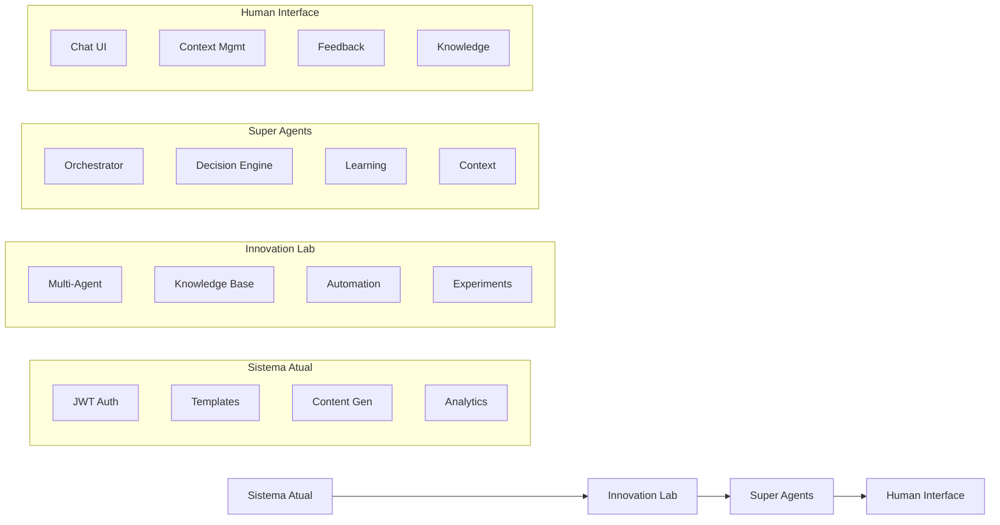

# Fluxo de Integração dos Sistemas

## Visão Geral
O sistema é composto por quatro módulos principais que se integram de forma sequencial para fornecer uma solução completa de automação e inovação.

## 1. Sistema Atual
**Base do projeto e funcionalidades core**

### Componentes
- Autenticação JWT
- Gerenciamento de Templates
- Geração de Conteúdo
- Analytics Base

### Integrações
- API REST
- Cache Layer
- Monitoring

## 2. Innovation Lab
**Centro de inovação e experimentação**

### Componentes
- Multi-Agent System
- Knowledge Base
- Automation Lab
- Experiment Pipeline

### Integrações
- Vector Database
- Document Store
- ML Pipeline

## 3. Super Agents
**Sistema avançado de agentes inteligentes**

### Componentes
- Agent Orchestrator
- Decision Engine
- Learning System
- Context Manager

### Integrações
- Agent API
- Memory Store
- Analytics Engine

## 4. Human Interface
**Interface de interação com usuários**

### Componentes
- Chat Interface
- Context Management
- Feedback System
- Knowledge Explorer

### Integrações
- Real-time API
- Memory Cache
- Analytics

## Fluxo de Integração

## Detalhamento das Integrações

### 1. Sistema Atual → Innovation Lab
- O Sistema Atual fornece a base de autenticação e gerenciamento
- Templates e conteúdos gerados alimentam a Knowledge Base
- Analytics base fornece dados para o ML Pipeline

### 2. Innovation Lab → Super Agents
- Knowledge Base alimenta os agentes
- Experiment Pipeline treina e melhora os agentes
- ML Pipeline otimiza as decisões

### 3. Super Agents → Human Interface
- Agentes interagem via Chat Interface
- Context Manager mantém o estado das interações
- Feedback System melhora os agentes
- Knowledge Explorer acessa a base de conhecimento

## Tecnologias de Integração

### APIs e Comunicação
- REST APIs para comunicação síncrona
- WebSockets para comunicação real-time
- Message Queues para processamento assíncrono

### Armazenamento
- Databases relacionais para dados estruturados
- Vector Stores para embeddings e similaridade
- Document Stores para conhecimento não estruturado
- Cache layers para performance

### Monitoramento
- Logging centralizado
- Métricas de performance
- Analytics de uso
- Alertas e notificações

## Considerações de Segurança

### Autenticação e Autorização
- JWT para autenticação entre serviços
- RBAC para controle de acesso
- API Keys para integrações externas

### Proteção de Dados
- Encryption em trânsito
- Encryption em repouso
- Sanitização de inputs
- Validação de dados

## Observabilidade

### Métricas Coletadas
- Latência entre integrações
- Taxa de sucesso/erro
- Uso de recursos
- Performance de ML/AI

### Logs e Traces
- Logs estruturados
- Distributed tracing
- Error tracking
- Performance profiling 