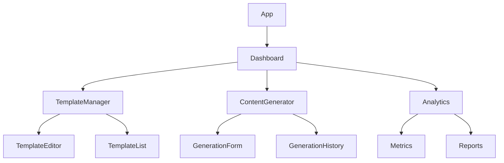
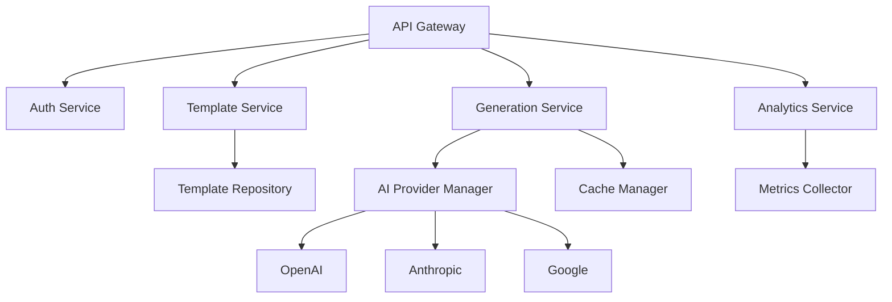
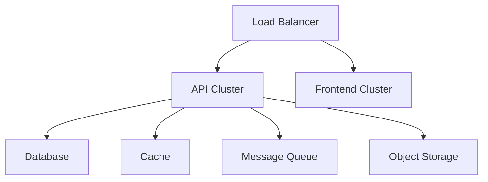

# Arquitetura do Sistema

## Visão Geral
O AI Agency é uma plataforma distribuída para gerenciamento e geração de conteúdo usando múltiplos provedores de IA.

## Componentes Principais

### 1. Frontend (React)


### 2. Backend (Python/FastAPI)


### 3. Infraestrutura


## Fluxos Principais

### 1. Geração de Conteúdo
```sequence
User->Frontend: Solicita geração
Frontend->API: POST /generations
API->TemplateService: Valida template
TemplateService->GenerationService: Processa geração
GenerationService->AIProvider: Gera conteúdo
AIProvider->GenerationService: Retorna resultado
GenerationService->Cache: Armazena resultado
GenerationService->API: Retorna resposta
API->Frontend: Exibe resultado
Frontend->User: Mostra conteúdo
```

### 2. Gerenciamento de Templates
```sequence
User->Frontend: Edita template
Frontend->API: PUT /templates/{id}
API->TemplateService: Valida mudanças
TemplateService->Database: Atualiza template
Database->TemplateService: Confirma atualização
TemplateService->API: Retorna status
API->Frontend: Atualiza UI
Frontend->User: Mostra confirmação
```

## Decisões Técnicas

### 1. Stack Tecnológico

#### Frontend
- **Framework**: React 18
- **State Management**: Redux Toolkit
- **Routing**: React Router 6
- **UI Components**: Material-UI
- **Testing**: Jest + RTL
- **Build Tool**: Vite

#### Backend
- **Framework**: FastAPI
- **ORM**: SQLAlchemy
- **Cache**: Redis
- **Queue**: RabbitMQ
- **Testing**: Pytest
- **Documentation**: OpenAPI/Swagger

#### Infraestrutura
- **Container**: Docker
- **Orchestration**: Kubernetes
- **CI/CD**: GitHub Actions
- **Monitoring**: Prometheus + Grafana
- **Logging**: ELK Stack

### 2. Padrões de Design

#### Frontend
```typescript
// Exemplo de Container Component
interface Props {
  templateId: string;
}

const TemplateEditorContainer: React.FC<Props> = ({ templateId }) => {
  const template = useTemplate(templateId);
  const dispatch = useDispatch();

  const handleSave = async (data: TemplateData) => {
    await dispatch(updateTemplate({ id: templateId, data }));
  };

  return (
    <TemplateEditor
      template={template}
      onSave={handleSave}
    />
  );
};
```

#### Backend
```python
# Exemplo de Service Layer
class TemplateService:
    def __init__(self, repository: TemplateRepository):
        self.repository = repository

    async def create_template(self, data: TemplateCreate) -> Template:
        template = Template(**data.dict())
        return await self.repository.create(template)

    async def update_template(self, id: str, data: TemplateUpdate) -> Template:
        template = await self.repository.get(id)
        if not template:
            raise NotFoundException()
        
        return await self.repository.update(id, data)
```

### 3. Escalabilidade

#### Horizontal Scaling
```yaml
# kubernetes/api-deployment.yaml
apiVersion: apps/v1
kind: Deployment
metadata:
  name: api
spec:
  replicas: 3
  selector:
    matchLabels:
      app: api
  template:
    metadata:
      labels:
        app: api
    spec:
      containers:
      - name: api
        image: aiagency/api:latest
        resources:
          limits:
            cpu: "1"
            memory: "1Gi"
          requests:
            cpu: "500m"
            memory: "512Mi"
```

#### Caching Strategy
```python
# Exemplo de Cache Manager
class CacheManager:
    def __init__(self, redis: Redis):
        self.redis = redis

    async def get_generation(self, key: str) -> Optional[Generation]:
        data = await self.redis.get(f"generation:{key}")
        return Generation.parse_raw(data) if data else None

    async def set_generation(self, key: str, generation: Generation):
        await self.redis.set(
            f"generation:{key}",
            generation.json(),
            ex=3600  # 1 hora
        )
```

### 4. Segurança

#### Authentication
```python
# Exemplo de Auth Middleware
class AuthMiddleware:
    async def __call__(self, request: Request, call_next):
        token = request.headers.get("Authorization")
        if not token:
            raise UnauthorizedException()

        try:
            payload = jwt.decode(token, settings.JWT_SECRET)
            request.state.user = payload
        except JWTError:
            raise UnauthorizedException()

        return await call_next(request)
```

#### Rate Limiting
```python
# Exemplo de Rate Limiter
class RateLimiter:
    def __init__(self, redis: Redis):
        self.redis = redis

    async def check_limit(self, key: str, limit: int, window: int) -> bool:
        current = await self.redis.incr(f"ratelimit:{key}")
        if current == 1:
            await self.redis.expire(f"ratelimit:{key}", window)
        
        return current <= limit
```

## Monitoramento

### 1. Métricas

#### Application Metrics
```python
# Exemplo de Metrics Collector
class MetricsCollector:
    def __init__(self, prometheus: PrometheusClient):
        self.prometheus = prometheus
        self.generation_counter = Counter(
            "generations_total",
            "Total number of content generations",
            ["status", "provider"]
        )
        self.generation_duration = Histogram(
            "generation_duration_seconds",
            "Time spent generating content",
            ["provider"]
        )

    def record_generation(self, provider: str, duration: float, status: str):
        self.generation_counter.labels(status, provider).inc()
        self.generation_duration.labels(provider).observe(duration)
```

#### Infrastructure Metrics
```yaml
# prometheus/rules.yaml
groups:
  - name: aiagency
    rules:
      - alert: HighErrorRate
        expr: rate(http_requests_total{status=~"5.."}[5m]) > 0.1
        for: 5m
        labels:
          severity: critical
        annotations:
          summary: High error rate detected
```

### 2. Logging

#### Structured Logging
```python
# Exemplo de Logger
class Logger:
    def __init__(self):
        self.logger = logging.getLogger("aiagency")

    def log_generation(self, generation_id: str, template_id: str, status: str):
        self.logger.info("Content generation completed", extra={
            "generation_id": generation_id,
            "template_id": template_id,
            "status": status,
            "timestamp": datetime.utcnow().isoformat()
        })
```

## Recursos Adicionais

### Documentação
- [API Reference](/docs/api)
- [Frontend Architecture](/docs/frontend)
- [Deployment Guide](/docs/deployment)

### Diagramas
- [Componentes](/docs/diagrams/components)
- [Sequência](/docs/diagrams/sequence)
- [Infraestrutura](/docs/diagrams/infrastructure)

### Guias
- [Development Setup](/docs/setup)
- [Contributing](/docs/contributing)
- [Security](/docs/security) 