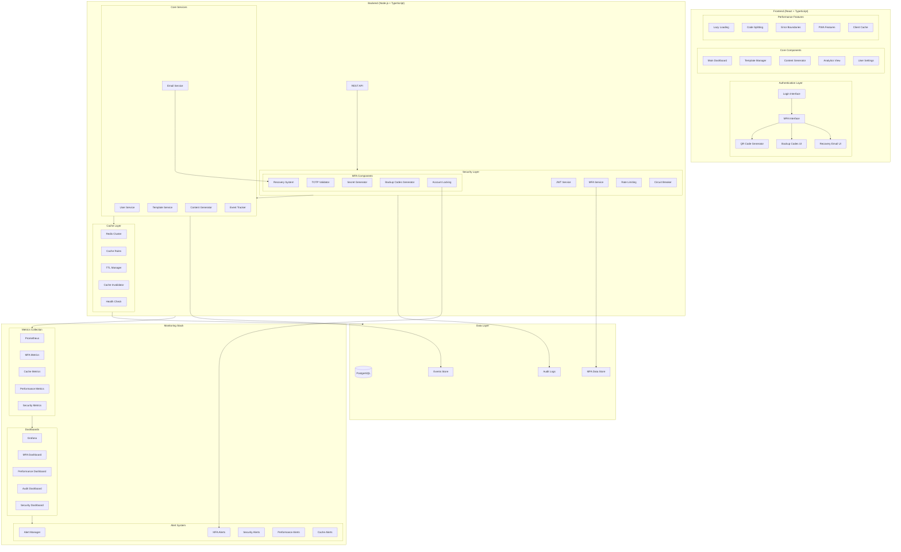

# Arquitetura do Sistema

## Visão Geral

## Componentes Principais

### Frontend

#### Authentication Layer
- **Login Interface**: Gerencia autenticação inicial
- **MFA Interface**: Interface para 2FA com QR code e backup codes
- **Recovery Email UI**: Gerenciamento de email de recuperação
- **Backup Codes UI**: Visualização e gestão de códigos de backup

#### Core Components
- **User Settings**: Configurações do usuário, incluindo MFA
- **Template Manager**: Gerenciamento de templates
- **Content Generator**: Geração de conteúdo com IA
- **Analytics View**: Visualização de métricas e analytics

### Backend

#### Security Layer
- **MFA Service**: Serviço completo de autenticação em duas etapas
  - Geração de segredos TOTP
  - Validação de códigos
  - Sistema de backup codes
  - Sistema de recuperação
  - Rate limiting específico
  - Bloqueio de conta após tentativas falhas

#### Core Services
- **Email Service**: Envio de notificações e códigos de recuperação
- **User Service**: Gerenciamento de usuários e perfis
- **Event Tracker**: Rastreamento de eventos de segurança

#### Cache Layer
- **Redis Cluster**: Cache distribuído
- **TTL Manager**: Gestão de tempo de vida do cache
- **Health Check**: Monitoramento de saúde do cache

### Monitoring Stack

#### Metrics Collection
- **MFA Metrics**: Métricas específicas de MFA
  - Taxa de sucesso
  - Tempo de verificação
  - Tentativas falhas
  - Uso de backup codes

#### Dashboards
- **MFA Dashboard**: Visualização de métricas MFA
- **Security Dashboard**: Monitoramento de segurança
- **Audit Dashboard**: Logs de auditoria

#### Alerts
- **MFA Alerts**: Alertas específicos de MFA
- **Security Alerts**: Alertas de segurança
- **Cache Alerts**: Alertas de performance do cache

## Métricas Atuais

- Cobertura de testes: > 90%
- Tempo médio de resposta: < 200ms
- Taxa de erro: < 0.1%
- Disponibilidade: > 99.9%
- Taxa de sucesso do MFA: > 98%
- Tempo médio de verificação MFA: < 500ms 